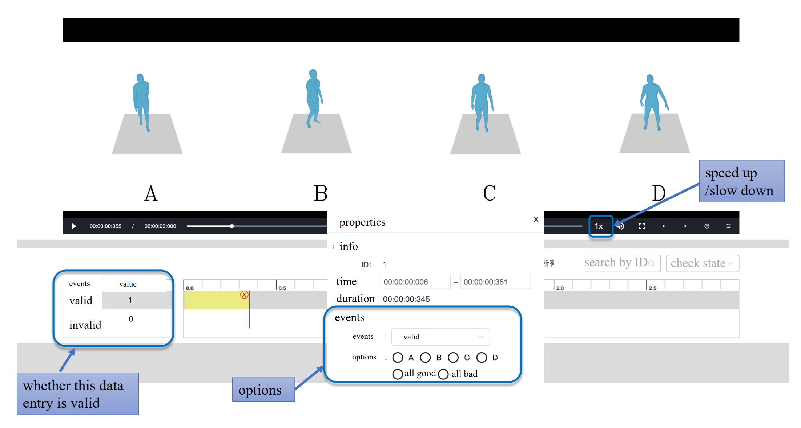

# Annotation Process and Dataset Preparation

## Introduction

We complete all our annotation on an annotation platform.



## Steps for Reorganization and Dataset Preparation

1. **Extract Filename and Choice**:
   - Parse each annotation result.
   - Extract the `filename` from the `filePath`.
   - Extract the `choice` from the `properties` field in the `events` list.

2. **Create Dictionary**:
   - Construct a dictionary where each key is the `filename` and the corresponding value is the `choice`.

3. **Prepare Motion Files**:
   - Follow the instructions in `motion.md` to process and prepare the corresponding motion `.npz` files.

4. **Pack into Datasets**:
   - Use the guidelines in `dataset.md` to pack the prepared motion files into datasets.

## Usage

A typical annotation result for a video is structured as follows:

```json
{
    "filePath": "path_to_the_file/filename-ABCD.mp4",
    "info": {
        "duration": 3,
        "framecount": 60,
        "framerate": 20,
        "width": 3840,
        "height": 960
    },
    "events": [
        {
            "id": 1,
            "event": "valid",
            "startTime": 0.643,
            "endTime": 0.98,
            "properties": {
                "Whether natural or not": "D"
            }
        }
    ]
}
```

The results indicate whether the annotation is valid and specify the choice from A/B/C/D. Then, the annotation results need to be reorganized into a dictionary with the format:

```json
{
    "filename": "choice"
}
```

Where `choice` can be one of the following values: `"A"`, `"B"`, `"C"`, `"D"`, `"allgood"`, or `"allbad"`.


Then, you may refer to the `motion.md` file for detailed information on how to handle and process motion files. Refer to the `dataset.md` file for guidelines on how to prepare and pack the motion `.npz` files into datasets.
